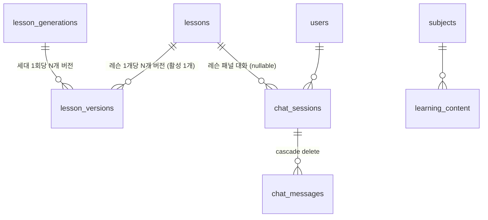

# LearnSphere API — 코드 학습 가이드

> **이 문서의 목적**: 백엔드 코드를 처음 읽는 사람이 "어디에 무엇이 있고, 왜 그렇게 지었는지"를 이해하도록 돕는다.
>
> 다른 문서와의 관계:
> - [ARCHITECTURE.md](./ARCHITECTURE.md) — **레퍼런스**. 테이블 컬럼, 엔드포인트 명세, 환경 변수 등을 찾아볼 때
> - [README.md](./README.md) — **실행 방법**. 설치하고 띄울 때
> - 이 문서 — **설계 이해**. 코드를 읽고 고칠 때
>
> 기준 시점: 2026-07-27 (Phase 12 / M1 완료 시점)

---

## 1. 먼저 알아야 할 것 — 이 프로젝트에는 축이 둘이다

코드를 읽다 헷갈리는 가장 큰 이유는 성격이 다른 두 기능이 한 앱에 들어 있기 때문이다. 이 둘을 분리해서 보면 구조가 단순해진다.

| | **① 콘텐츠 생성 축** | **② 학습·대화 축** |
|---|---|---|
| 누가 | 관리자 (또는 웹훅) | 학습자 |
| 무엇을 | React 문서로 레슨을 써서 DB에 쌓는다 | 레슨을 읽고 튜터에게 질문한다 |
| 인증 | `X-Admin-API-Key` | JWT Bearer |
| 실행 시간 | 수십 분 (백그라운드) | 수 초 (스트리밍) |
| Qdrant 사용법 | `scroll` — 레벨 문서 **전량** | `query_points` — 질문과 가까운 **top-4** |
| 핵심 파일 | `services/content_pipeline_service.py` | `agents/tutor_agent.py` |
| 핵심 테이블 | `lesson_generations` / `lessons` / `lesson_versions` | `users` / `chat_sessions` / `chat_messages` |

두 축이 만나는 지점은 하나뿐이다: **레슨 패널에서 질문하면 그 레슨 본문이 튜터의 근거로 들어간다** (`chat_api.build_lesson_context()`).

---

## 2. 기술 스택

| 구분 | 기술 | 비고 |
|---|---|---|
| 웹 프레임워크 | FastAPI + Uvicorn | |
| ORM / 마이그레이션 | SQLAlchemy 2.0 + Alembic | 현재 리비전 `0004` |
| 관계형 DB | PostgreSQL 16 (Docker) | 레슨 본문·유저·대화 |
| 벡터 DB | Qdrant Cloud | 컬렉션 `react-docs-openai` (1536차원) |
| LLM | OpenAI `gpt-4o-mini` | 레슨 생성 + 튜터 챗 |
| 임베딩 | OpenAI `text-embedding-3-small` | 인덱싱·검색 공용 |
| 에이전트 | LangGraph 1.x + LangChain Core 1.x | 튜터 그래프 |
| 인증 | PyJWT (HS256) + bcrypt | passlib 미사용 (bcrypt 4.x 호환 이슈) |
| 테스트 | pytest + 인메모리 SQLite | 132개 |
| 패키지 관리 | uv | `pyproject.toml` + `uv.lock` |

---

## 3. 디렉터리와 레이어 규칙

```
app/
├── main.py            앱 진입점 — CORS · 라우터 등록 · 웹훅 · 헬스체크
│
├── api/               ★ HTTP 경계. 얇게 유지한다
│   ├── lesson_api.py      레슨 조회 (공개, 27줄)
│   ├── admin_api.py       생성 트리거 · 세대/버전 관리 (관리자 키)
│   ├── auth_api.py        가입 · 로그인 · /me (공개)
│   └── chat_api.py        대화 세션 CRUD · 메시지 · SSE 스트림 (JWT)
│
├── agents/            ★ LangGraph 에이전트
│   └── tutor_agent.py     retrieve → generate 2노드 선형 그래프
│
├── services/          ★ 외부 시스템 연동 · 오케스트레이션
│   ├── qdrant_service.py            벡터 DB 접근 2종
│   ├── embedding_service.py         OpenAI 임베딩 (토큰 계산 · 배치)
│   ├── openai_service.py            레슨 생성 LLM 호출 + 스키마 검증
│   └── content_pipeline_service.py  생성 파이프라인 흐름
│
├── crud/              ★ DB 접근. SQLAlchemy 쿼리만
│   ├── crud_lessons.py    세대/버전 전환 로직 (251줄, 가장 정교함)
│   ├── crud_chat.py       세션·메시지
│   ├── crud_users.py      유저
│   └── crud_content.py    콘텐츠 메타데이터
│
├── models/models.py   SQLAlchemy 테이블 8개
├── schemas/           Pydantic — 도메인별 파일 분리
│   ├── schemas.py         레슨 (LessonContentSchema = 생성물 검증 정본)
│   ├── auth.py            인증
│   └── chat.py            챗
├── core/              횡단 관심사
│   ├── database.py        engine · SessionLocal · get_db · session_scope
│   ├── auth.py            bcrypt + JWT + get_current_user 의존성
│   ├── security.py        X-Admin-API-Key 검증 (20줄)
│   └── taxonomy.py        레벨 ↔ sub_category 매핑
└── scripts/           일회성 스크립트 (seed / import / enrichment)
```

### 레이어 규칙 3가지

1. **`api`는 HTTP만 다룬다.** 상태 코드 결정, 요청 검증, 의존성 주입까지. 로직은 `services`/`crud`로 내린다.
2. **`crud`는 대체로 커밋하지 않는다.** `upsert_lesson`, `insert_version`은 `db.flush()`만 하고 커밋은 호출자(파이프라인)가 한다. 트랜잭션 경계를 서비스가 잡기 위해서다. 예외는 세대 전환 함수들(`finalize_generation` 등)로, 이들은 "단일 트랜잭션"이 계약의 일부라 스스로 커밋한다.
3. **스키마는 도메인별로 쪼갠다.** 레슨 스키마가 있던 `schemas.py`에 챗을 얹지 않고 `chat.py`를 새로 만들었다.

---

## 4. 데이터 모델

### 4.1 전체 그림



8개 테이블이 세 무리로 나뉜다.

| 무리 | 테이블 | 역할 |
|---|---|---|
| **레슨 콘텐츠** | `lesson_generations`, `lessons`, `lesson_versions` | 이 프로젝트의 핵심 |
| **유저·대화** | `users`, `chat_sessions`, `chat_messages` | Phase 7·9에서 추가 |
| **메타데이터/유산** | `subjects`, `learning_content`, `lesson_backups` | 시딩 데이터 + DEPRECATED |

### 4.2 레슨 3형제 — 왜 본문이 `lessons`에 없나

```
LessonGeneration   "생성 배치 1회" = 세대
      │ 1:N
LessonVersion      불변 본문 (title, core_concepts, code_examples, quizzes, is_current)
      │ N:1
Lesson             정체성만 (level + slug 유니크, archived_at)
```

`Lesson`은 **"이건 어떤 레슨인가"**만 갖는다. 본문은 전부 `LessonVersion`에 있고, 그중 `is_current=True`인 하나가 사용자에게 보인다.

이렇게 지은 이유는 `models.py:110-127`의 주석에 있다:

> 표시 순번(position)은 세대마다 바뀔 수 있어 키가 아니며, **(level, slug)가 재생성 간에 같은 레슨을 잇는 유일 키**다.

즉 레슨을 다시 생성해도 "useState 레슨"은 같은 `lessons.id`를 유지한다. 그래서 프론트의 북마크(`learnsphere.lastLesson`)나 `chat_sessions.lesson_id` 같은 참조가 재생성 후에도 깨지지 않는다.

**DB 레벨 보장** (`models.py:145-148`):

```python
UniqueConstraint('lesson_id', 'generation_id')   # 한 세대에 레슨당 버전 1개
Index('uq_lesson_versions_current', 'lesson_id', unique=True,
      postgresql_where=text('is_current'), sqlite_where=text('is_current'))
```

두 번째가 **partial unique index**다. "레슨당 활성 버전은 최대 1개"를 애플리케이션 코드가 아니라 DB가 강제한다. 버그로 두 버전을 활성화하려 하면 DB가 거부한다.

---

## 5. 핵심 설계 ① — 세대 전환 (가장 먼저 읽을 코드)

📖 **읽을 곳**: `crud/crud_lessons.py:98-183`

레슨 재생성은 위험한 작업이다. 50개 레슨을 다시 쓰는 데 수십 분이 걸리는데, 그동안 사용자가 반쯤 갱신된 목록을 보면 안 된다. 이 프로젝트는 그 문제를 이렇게 푼다.

### 3단계

```
1. 적재    새 버전을 is_current=False로 쌓는다 → 사용자에게 안 보임
           (레슨 하나 끝날 때마다 커밋해도 안전한 이유)
2. 완료    finalize_generation()이 단일 트랜잭션으로 활성 전환
3. 정리    세대에 없는 레슨은 archived_at 설정 (삭제 아님)
```

### `finalize_generation()`이 처리하는 세 부류

```python
new_versions = 이번 세대에 생성된 버전들
failed_keys  = 실패한 (level, slug) 집합
```

| 레슨 종류 | 처리 |
|---|---|
| 새 버전이 **있음** | 기존 current 해제 → 새 버전 current, `archived_at` 해제 |
| 생성 **실패** | 아무것도 안 함 → **이전 버전이 그대로 살아 있다** |
| 세대에 **없음** (토픽이 사라짐) | `archived_at = now` → 목록에서 숨김, 데이터는 보존 |

이게 **부분 성공 허용** 설계다. 레슨 50개 중 3개가 LLM 오류로 실패해도, 나머지 47개는 갱신되고 실패한 3개는 옛 버전을 유지한다. 실패 내역은 `lesson_generations.failed_topics`(JSON)에 남아 관리자 패널에서 볼 수 있다.

### 왜 `update(..., synchronize_session=False)`인가

```python
db.query(LessonVersion).filter(...).update({...}, synchronize_session=False)
db.flush()   # ← 이 flush가 중요하다
db.query(LessonVersion).filter(...).update({LessonVersion.is_current: True}, ...)
```

- `update()`는 ORM 객체를 하나씩 로드하지 않고 **한 방에 UPDATE 문**을 날린다. 수백 개 버전을 다룰 때 필요하다.
- `synchronize_session=False`는 "세션의 파이썬 객체는 갱신하지 마라"는 뜻. 어차피 직후에 커밋하므로 동기화 비용이 낭비다.
- **중간의 `flush()`가 핵심이다.** 해제 UPDATE를 먼저 DB에 내보내지 않으면, 설정 UPDATE와 순서가 섞여 partial unique index를 위반한다. (§4.2의 인덱스가 실수를 잡아준다)

### 복원은 파일 복사가 아니다

```python
def restore_version(db, lesson_id, version_id):   # crud_lessons.py:195
```

버전이 불변이므로 "복원 전 백업"이 필요 없다. `is_current` 플래그를 옮기는 것뿐이라 몇 번을 왕복해도 데이터가 손실되지 않는다. 파일 기반 시절에는 복원 전에 현재 파일을 백업 폴더에 복사해야 했다 — `lesson_backups` 테이블이 그 시절의 유산이다.

---

## 6. 핵심 설계 ② — 인증이 두 갈래인 이유

| | 관리자 | 학습자 |
|---|---|---|
| 방식 | `X-Admin-API-Key` 헤더 | `Authorization: Bearer <JWT>` |
| 구현 | `core/security.py` (20줄) | `core/auth.py` (97줄) |
| 저장 | 환경 변수 `ADMIN_API_KEY` 하나 | `users` 테이블 |
| 적용 | `admin_api` 라우터 전체 + 웹훅 | `chat_api` 라우터 전체 |
| 만료 | 없음 | 7일 (`JWT_EXPIRE_MINUTES`) |

📖 **읽을 곳**: `core/auth.py`

`User` 모델에 **`role` 컬럼이 없다**. 관리자는 계정이 아니라 공유 키 하나이기 때문이다. `models.py:12-14`의 주석이 이를 명시한다:

> 관리자는 여전히 X-Admin-API-Key 체계를 쓰므로 role 컬럼을 두지 않는다. (학습자 인증과 관리자 인증은 별개 경로다.)

### 눈여겨볼 세 가지

**1. 라우터 단위로 인증을 건다**

```python
# admin_api.py:15
router = APIRouter(dependencies=[Depends(verify_admin_key)])
```

엔드포인트마다 붙이지 않고 라우터에 한 번 건다. 새 관리자 엔드포인트를 추가할 때 인증을 빠뜨릴 수 없다.

**2. 비밀 키 미설정은 401이 아니라 503**

```python
def _get_secret_key() -> str:      # core/auth.py:26
    secret = os.getenv("JWT_SECRET_KEY")
    if not secret:
        raise HTTPException(503, "서버에 JWT_SECRET_KEY가 설정되지 않았습니다.")
```

빈 키로 서명해버리면 누구나 토큰을 위조할 수 있다. 설정 실수를 인증 실패로 위장하지 않고 **서버 오류로 드러낸다**.

**3. 깨진 해시를 예외가 아니라 실패로 처리**

```python
def verify_password(password, password_hash) -> bool:
    try:
        return bcrypt.checkpw(...)
    except ValueError:
        return False   # 해시 형식이 깨진 경우(예: 평문 저장) 인증 실패로
```

---

## 7. 핵심 설계 ③ — Qdrant를 쓰는 방식이 두 가지

📖 **읽을 곳**: `services/qdrant_service.py` (133줄, 함수 딱 2개)

| | `get_contexts_by_level(level)` | `search_similar(query, top_k, level)` |
|---|---|---|
| 방식 | `scroll()` — 페이지네이션 전량 순회 | `query_points()` — 벡터 유사도 |
| 임베딩 | **안 씀** (필터만) | 질문을 임베딩해서 검색 |
| 반환 | `{토픽: 컨텍스트 전문}` | `[{text, title, source, score}]` |
| 쓰는 곳 | 레슨 **생성** 파이프라인 | 튜터 **챗** (RAG) |

생성은 "이 레벨 문서 전부 줘"라서 유사도가 필요 없다. 챗은 "이 질문과 가까운 4개만"이라 유사도가 전부다.

**두 함수가 공유하는 것**: `_level_filter()` — 레벨을 `sub_category` 필터로 바꾸는 헬퍼. 매핑은 `core/taxonomy.py`에 있다.

### 검색 실패를 삼키는 이유

```python
except Exception as e:
    # 검색이 실패해도 챗 자체는 답변할 수 있어야 하므로 빈 결과로 축약한다.
    print(f"  > [Qdrant] 유사도 검색 실패: {e}")
    return []
```

Qdrant가 죽어도 튜터는 일반 지식으로 답한다. 튜터 프롬프트에는 "참고 문서를 찾지 못했습니다 — 일반적인 React 지식으로 답하되, 불확실하면 그렇다고 밝히세요"라는 폴백 문구가 준비돼 있다 (`tutor_agent.py:73`).

반대로 **레슨 생성**에서 LLM이 실패하면 삼키지 않고 `LessonGenerationError`를 던진다. 과거에는 오류 메시지를 `core_concepts`에 담은 "에러 레슨"을 정상 반환했는데, DB로 이관하면서 그 텍스트가 정식 버전으로 영구 저장되는 문제가 생겨 명시적 예외로 바꿨다 (`openai_service.py:19-25`).

> **배울 점**: 같은 "외부 호출 실패"라도 **되돌릴 수 있는가**에 따라 처리가 달라진다. 챗은 다시 물으면 되지만, 잘못 저장된 레슨은 남는다.

---

## 8. 핵심 설계 ④ — LangGraph 튜터

📖 **읽을 곳**: `agents/tutor_agent.py` (195줄)

LangGraph의 최소 형태다. 처음 배우기에 좋다.

```
START → retrieve → generate → END
```

### 구성 요소 4개

**① State** (`tutor_agent.py:39`) — 노드 사이를 흐르는 데이터

```python
class TutorState(TypedDict, total=False):
    question: str
    history: List[ChatTurn]
    lesson_context: Optional[str]
    retrieved: List[Dict]       # retrieve가 채움
    answer: str                 # generate가 채움
```

**② 노드** — State를 받아 **바뀐 부분만** 딕셔너리로 반환한다

```python
def retrieve(state):  return {"retrieved": qdrant_service.search_similar(...)}
def generate(state):  return {"answer": response.content}
```

**③ 그래프 조립** (`build_tutor_graph()`) — 노드 등록 + 엣지 연결 후 `compile()`

**④ 진입점** — 동기 `run_tutor()`와 비동기 `astream_tutor()` 둘

### 프롬프트 조립 순서에 의미가 있다

```python
def _build_context(state) -> str:       # tutor_agent.py:58
    blocks = []
    if lesson_context: blocks.append(f"[현재 학습 중인 레슨]\n{lesson_context}")   # ← 먼저
    for doc in retrieved: blocks.append(f"[{doc['title']}]\n{doc['text']}")       # ← 나중
```

레슨 컨텍스트를 **앞에** 두어, 학습자가 보고 있는 레슨이 우선 근거가 되게 한다. 테스트가 이 순서를 검증한다 (`test_tutor_puts_lesson_context_before_retrieved_docs`).

이력은 `MAX_HISTORY_TURNS = 10`으로 잘라낸다. 토큰 비용과 응답 지연을 억제하기 위해서다.

### checkpointer를 쓰지 않는다

LangGraph에는 대화 상태를 저장하는 checkpointer 기능이 있지만 쓰지 않는다. 이유는 파일 상단 주석에 있다:

> Phase 9에서 DB가 이력의 주인이 되므로, 그래프가 별도 저장소를 갖지 않는 편이 단순하다.

이력은 매 요청마다 `chat_api`가 DB에서 읽어 주입한다. 저장소가 둘이면 동기화 문제가 생긴다.

### 스트리밍은 이벤트 필터링

```python
async def astream_tutor(...):           # tutor_agent.py:161
    async for event in _get_graph().astream_events(inputs, version="v2"):
        if event.get("event") == "on_chat_model_stream":
            yield {"type": "token", "content": chunk.content}
        elif event.get("event") == "on_chain_end":
            retrieved = output["retrieved"]   # 출처 수집
    yield {"type": "sources", "sources": _extract_sources(retrieved)}
```

`astream_events()`는 그래프 실행 중 일어나는 **모든** 이벤트를 쏟아낸다. 그중 LLM 토큰만 골라낸다.

> **왜 이 함수 하나에 몰아넣었나**: LangGraph의 이벤트 이름·구조는 버전에 따라 바뀐다. 그 의존을 `astream_tutor` 한 곳에 가둬, 라이브러리가 바뀌어도 API 레이어는 손대지 않아도 되게 했다. 호출부는 `{"type":"token"|"sources"}` 두 형태만 안다.

---

## 9. 핵심 설계 ⑤ — DB 세션의 수명

이 프로젝트에서 가장 헷갈리기 쉬운 부분이다. `core/database.py`에 세션을 얻는 방법이 **세 가지** 있다.

| 방법 | 언제 | 예시 |
|---|---|---|
| `Depends(get_db)` | 보통의 요청 | 대부분의 엔드포인트 |
| `SessionLocal()` 직접 | 백그라운드 작업 | `content_pipeline_service.py:59` |
| `session_scope()` | 스트리밍 응답 | `chat_api.answer_stream()` |

### 왜 나뉘는가

`Depends(get_db)`가 준 세션은 **응답이 끝나면 닫힌다**. 그런데:

**① 백그라운드 작업은 요청보다 오래 산다**

```python
# main.py / admin_api.py
background_tasks.add_task(content_pipeline_service.run_full_content_generation, generation.id)
```

응답은 즉시 나가고 작업은 수십 분 계속된다. 그래서 파이프라인은 세션을 직접 만든다:

```python
def run_full_content_generation(generation_id: int):
    db = SessionLocal()          # ← 요청 스코프 밖이므로 직접 생성
    try:    ...
    finally: db.close()
```

객체가 아니라 **`generation_id`(정수)를 넘긴다**는 점도 중요하다. ORM 객체를 넘기면 원래 세션이 닫힌 뒤 `DetachedInstanceError`가 난다.

**② 스트리밍 응답 본문은 엔드포인트 함수가 반환된 뒤에 실행된다**

```python
@router.post("/sessions/{session_id}/stream")
async def stream_message(..., session_scope=Depends(get_session_scope)):
    ...
    return StreamingResponse(answer_stream(...))   # ← 여기서 함수는 끝난다
```

`StreamingResponse`를 반환한 시점에 엔드포인트는 종료되고, 제너레이터는 그 **이후에** 소비된다. 그래서 스트림이 끝난 뒤 답변을 저장할 때는 새 세션을 짧게 연다:

```python
finally:
    answer = "".join(chunks)
    if answer:
        with session_scope() as fresh_db:      # ← 새 세션
            stored = crud_chat.get_owned_session(fresh_db, session_id, user_id)
            crud_chat.add_message(fresh_db, stored, "assistant", answer, sources)
```

`session_scope`를 **의존성으로 주입**하는 이유는 테스트다. `tests/conftest.py`가 이걸 갈아끼워 스트림 저장도 테스트 DB를 보게 만든다.

### `finally`로 중도 이탈을 막는다

위 코드가 `try`가 아니라 `finally`에 있는 게 핵심이다. 클라이언트가 스트리밍 도중 연결을 끊으면 제너레이터가 닫히는데(`GeneratorExit`), `finally`는 그때도 실행된다. 그래서 **받다 만 답변도 저장된다**.

---

## 10. 두 축의 전체 흐름

### ① 레슨 생성

```
POST /admin/generate-all-content            (X-Admin-API-Key)
  │
  ├─ request_full_generation()
  │     running 세대가 있으면 → 409 (중복 실행 가드)
  │     없으면 lesson_generations 행 생성 (status=running)
  │
  ├─ {message, generation_id} 즉시 응답        ← 사용자는 여기서 끝
  │
  └─ BackgroundTask ──────────────────────────────────┐
                                                       ↓
      for level in [초급, 중급, 고급]:
        qdrant_service.get_contexts_by_level(level)   → {토픽: 컨텍스트}
        for 토픽 in 토픽들:
          openai_service.generate_lesson_with_llm()   → JSON
            └ normalize_lesson() → LessonContentSchema 검증
               실패 시 LessonGenerationError → failed_topics에 기록하고 계속
          crud_lessons.upsert_lesson()                → (level, slug)로 찾거나 생성
          crud_lessons.insert_version(is_current=False)
          db.commit()                                  ← 레슨 단위 커밋
                                                       ↓
      crud_lessons.finalize_generation()               ← 단일 트랜잭션 활성 전환
```

최상위에서 예외가 나면 `fail_generation()`으로 status='failed'만 기록한다. **활성 버전은 건드리지 않았으므로 사용자 영향이 없다.**

### ② 튜터 챗 (스트리밍)

```
POST /chat/sessions/{id}/stream             (Bearer JWT)
  │
  ├─ _require_session()          남의 세션이면 403
  ├─ _prepare_turn()
  │     세션에 lesson_id가 있으면 → build_lesson_context()로 레슨 본문 조립
  │     DB에서 이력 로드 (요청 본문이 아니라 DB가 이력의 주인)
  │     user 메시지 저장          ← 스트림 시작 전. 바로 끊어도 질문은 남는다
  │
  └─ StreamingResponse(answer_stream(...))
         │
         └─ astream_tutor()
              [retrieve]  질문 임베딩 → Qdrant top-4
              [generate]  레슨 + 검색문서 + 최근 10턴 → LLM 스트리밍
              │
              ├─ data: {"type":"token","content":"..."}   × N
              ├─ data: {"type":"done","sources":[...]}
              └─ finally: 누적 답변을 assistant 메시지로 저장
```

---

## 11. API 엔드포인트 한눈에

| 인증 | 메서드 | 경로 (`/api/v1` 생략) | 설명 |
|---|---|---|---|
| — | GET | `/lessons` | 활성 레슨 목록 (레벨별 그룹) |
| — | GET | `/lessons/{id}` | 활성 버전 본문 |
| — | GET | `/contents/{subject_name}` | 콘텐츠 메타데이터 |
| — | POST | `/auth/signup` · `/auth/login` | 가입 · 로그인 → 토큰 |
| JWT | GET | `/auth/me` | 내 정보 |
| JWT | POST/GET | `/chat/sessions` | 세션 생성 · 내 목록 |
| JWT | GET/DELETE | `/chat/sessions/{id}/messages` · `/chat/sessions/{id}` | 메시지 조회 · 세션 삭제 |
| JWT | POST | `/chat/sessions/{id}/messages` | 메시지 전송 (비스트리밍) |
| JWT | POST | `/chat/sessions/{id}/stream` | 메시지 전송 (SSE) |
| 키 | POST | `/admin/generate-all-content` | 전체 재생성 시작 |
| 키 | GET | `/admin/generations` · `/admin/generations/{id}` | 세대 목록 · 상세 |
| 키 | POST | `/admin/generations/{id}/activate` | 세대 일괄 전환 |
| 키 | GET | `/admin/lessons/{id}/versions` | 버전 목록 |
| 키 | POST | `/admin/lessons/{id}/restore` | 버전 복원 |
| 키 | POST | `/webhooks/content-updated` | 외부 트리거 (전체 재생성) |

상세 명세는 [ARCHITECTURE.md §5](./ARCHITECTURE.md)와 Swagger UI(`/docs`) 참고.

---

## 12. 테스트 구조

```bash
uv run pytest          # 132개
```

📖 **읽을 곳**: `tests/conftest.py` (86줄) — 여기부터 읽어야 나머지가 이해된다

### 핵심 트릭 3개

**1. import 전에 환경 변수를 고정한다**

```python
os.environ.setdefault("DATABASE_URL", "sqlite://")   # ← import보다 먼저
...
from app.core.database import Base, get_db
```

`database.py`가 **import 시점에** `create_engine(DATABASE_URL)`을 실행하기 때문이다. 이 순서가 깨지면 테스트가 실제 PostgreSQL에 붙는다.

**2. 인메모리 SQLite + StaticPool**

```python
create_engine("sqlite://", connect_args={"check_same_thread": False}, poolclass=StaticPool)
```

`StaticPool`이 없으면 커넥션마다 **다른** 인메모리 DB가 생긴다. TestClient는 별도 스레드에서 앱을 돌리므로 `check_same_thread=False`도 필요하다.

**3. 의존성 오버라이드 2개**

```python
app.dependency_overrides[get_db] = _override_get_db              # 요청 세션
app.dependency_overrides[get_session_scope] = lambda: _test_scope # 스트림 저장용 세션
```

두 번째가 없으면 SSE 테스트가 엉뚱한 빈 DB에 저장한다 (§9 참고).

### 파일별 담당

| 파일 | 개수 | 검증 대상 |
|---|---|---|
| `test_chat_api.py` | 26 | 세션 CRUD · 권한 · 이력 · SSE |
| `test_enrichment.py` | 26 | 원본 문서 가공 파이프라인 |
| `test_auth_api.py` | 14 | 가입 · 로그인 · 토큰 검증 |
| `test_lessons_crud.py` | 13 | 세대 전환 · 부분 성공 · 복원 |
| `test_embedding_service.py` | 13 | 배치 분할 · 순서 보존 · 토큰 한도 |
| `test_tutor_agent.py` | 12 | 그래프 순서 · 프롬프트 조립 · 스트림 이벤트 |
| `test_lessons_api.py` | 9 | 레슨 조회 API |
| `test_qdrant_search.py` | 7 | 유사도 검색 (`slow` 마커) |
| `test_pipeline_db.py` | 6 | 파이프라인 → DB 적재 |
| `test_import_script.py` | 6 | 일회성 파일 → DB 이관 |

(2026-07-27 `pytest --collect-only` 기준, 합계 132)

### 알아둘 함정

`test_stream_saves_partial_on_early_close`가 특이하게 생겼다. **TestClient는 스트리밍 응답을 끝까지 소비해버려 "클라이언트 중도 이탈"을 흉내 낼 수 없다.** 그래서 이 테스트만 응답 제너레이터(`chat_api.answer_stream`)를 직접 만들어 `aclose()`한다. 엔드포인트 클로저가 아닌 **모듈 함수**로 분리한 이유가 이것이다.

---

## 13. 학습 순서 제안

| 순서 | 파일 | 배울 것 | 분량 |
|---|---|---|---|
| 1 | `main.py` | 앱 구성 전체 조망 | 79줄 |
| 2 | `api/lesson_api.py` | 가장 단순한 엔드포인트 | 27줄 |
| 3 | `models/models.py` | 데이터 모델 · 주석에 설계 의도 | 148줄 |
| 4 | `crud/crud_lessons.py:98-183` | ★ **세대 전환** — 이 프로젝트의 정수 | 85줄 |
| 5 | `services/content_pipeline_service.py` | 파이프라인 전체 흐름 | 71줄 |
| 6 | `core/auth.py` | JWT + 의존성 주입 패턴 | 97줄 |
| 7 | `agents/tutor_agent.py` | LangGraph 최소 형태 | 195줄 |
| 8 | `api/chat_api.py` | 세션 수명 · SSE | 207줄 |
| 9 | `tests/conftest.py` + `tests/test_chat_api.py` | 무엇이 보장되는가 | 463줄 |

### 손으로 확인해보기

```bash
# 세대/버전 구조를 눈으로 보기
docker exec learnsphere-postgres psql -U user -d learnsphere_db -c \
  "select l.id, l.level, l.slug, v.id ver, v.generation_id gen, v.is_current
   from lessons l join lesson_versions v on v.lesson_id = l.id
   order by l.id limit 20;"

# 튜터 그래프를 파이썬 셸에서 직접 돌려보기
uv run python -c "
from app.agents import tutor_agent
answer, sources = tutor_agent.run_tutor('key prop은 왜 필요해?')
print(answer[:200]); print(sources)"

# SSE가 실제로 토큰을 나눠 보내는지
curl -N -X POST http://127.0.0.1:8000/api/v1/chat/sessions/1/stream \
  -H "Authorization: Bearer <토큰>" -H "Content-Type: application/json" \
  -d '{"message":"useState가 뭐야?"}'
```

---

## 14. 알아둘 만한 흔적들

코드를 읽다 마주칠 "왜 이게 여기 있지?" 목록.

| 발견 | 설명 |
|---|---|
| `lesson_backups` 테이블 | 파일 기반 백업 시절의 유산. 신규 기록 없음. drop 시점 미정 |
| `validated_json_server.py` | 포트 8001의 **별도 서버**. 메인 앱과 무관하게 단독 실행 |
| `POST /chat/sessions/{id}/messages` | 스트리밍(`/stream`)이 생긴 뒤에도 폴백으로 유지 |
| `qdrant_service`의 기본 컬렉션명 `react-docs-complete` | 구 sentence-transformers 컬렉션. `.env`가 `react-docs-openai`로 덮어씀. 구 컬렉션은 롤백 대비로 Qdrant에 남아 있음 |
| `print()` 기반 로깅 | `logging` 전환이 잔여 개선 과제 |
| `app/scripts/enrichment/` | 원본 문서 가공 파이프라인. 별도 문서 참고 |

---

## 관련 문서

- [ARCHITECTURE.md](./ARCHITECTURE.md) — 레퍼런스 (테이블 컬럼 · 엔드포인트 명세 · 환경 변수)
- [README.md](./README.md) · [PROCESS_AND_RUN.md](./PROCESS_AND_RUN.md) — 설치와 실행
- [db_detail.md](./db_detail.md) · [DB_MIGRATION_PLAN.md](./DB_MIGRATION_PLAN.md) — DB 이관 설계 근거
- [../CONTENT_FLOW.md](../CONTENT_FLOW.md) — 콘텐츠 생성→프론트 전달 흐름
- [../chat_bot_plan.md](../chat_bot_plan.md) · [../chat_bot_detail.md](../chat_bot_detail.md) — 챗봇 기획과 Phase 계획
- [../learnsphere-frontend/CODE_GUIDE.md](../learnsphere-frontend/CODE_GUIDE.md) — 프론트엔드 학습 가이드
